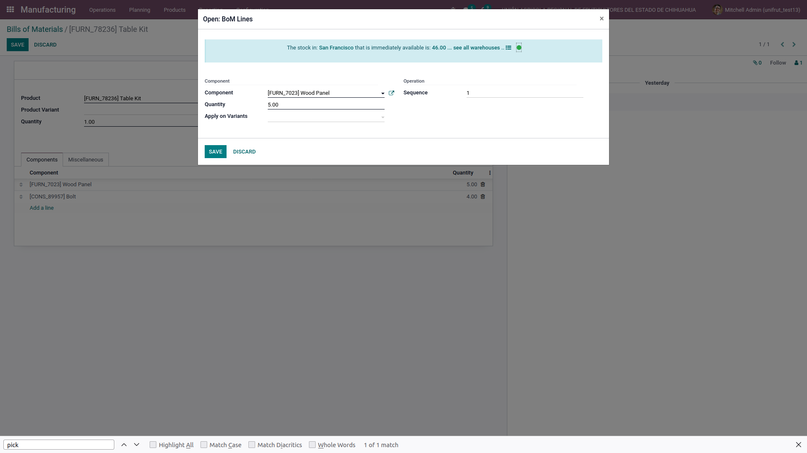

.. image:: https://img.shields.io/badge/licence-LGPL--3-blue.svg
    :alt: License: LGPL-3

Functional Rationale:
---------------------

Provide a nice widget in the product on the bill of material's line to see the quantity of product
by warehouse in order to help you to review such information as fast as possible.

In case there is no warehouse configured, the widget will not show that part of the text:

Notes:
------

This module relies on variants and multiple warehouse management
properly configured

Maintainer
----------

.. image:: https://www.vauxoo.com/logo.png
   :alt: Vauxoo
   :target: https://vauxoo.com

This module is maintained by Vauxoo.

a latinamerican company that provides training, coaching,
development and implementation of enterprise management
systems and bases its entire operation strategy in the use
of Open Source Software and its main product is Odoo.

To contribute to this module, please visit http://www.vauxoo.com
