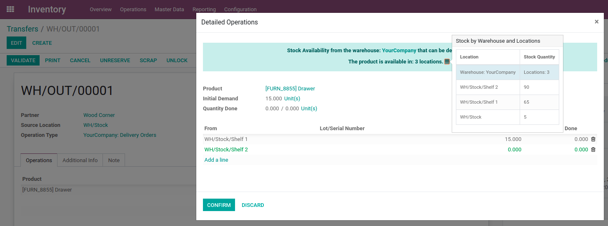

.. image:: https://img.shields.io/badge/licence-LGPL--3-blue.svg
    :alt: License: LGPL-3

Functional Rationale:
---------------------

Provide a nice widget in the product on the stock moves to see the quantity of product
by warehouse in order to help you to review such information as fast as possible.

It also, set a default locaation for the stock move line, this default value depends
on the location that has the highest quantity of the product in stock.

Developers usage:
-----------------

Developers can inherit this module as a fast way to get product availability
by warehouse in other views, by simply adding a related field.

Notes:
------

This module rely on variants and multiple warehouse management
properly configured.
The widget will only be seen on the stock moves when its transfer has the type of outgoing.

Maintainer
----------

.. image:: https://www.vauxoo.com/logo.png
   :alt: Vauxoo
   :target: https://vauxoo.com

This module is maintained by Vauxoo.

a latinamerican company that provides training, coaching,
development and implementation of enterprise management
systems and bases its entire operation strategy in the use
of Open Source Software and its main product is Odoo.

To contribute to this module, please visit http://www.vauxoo.com
