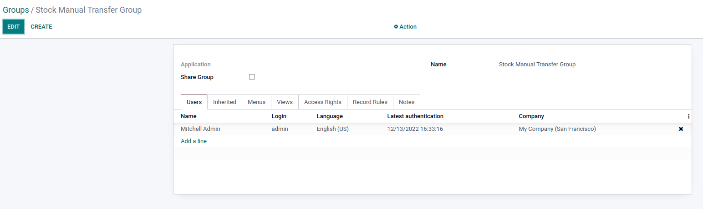
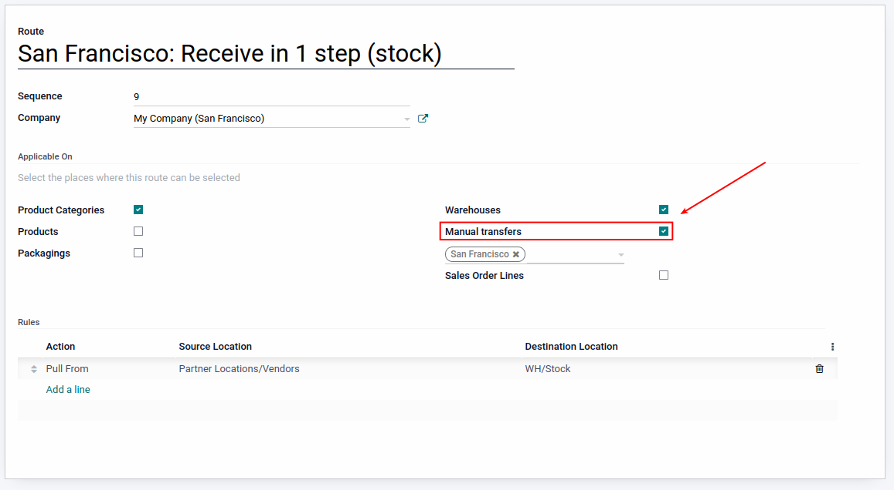
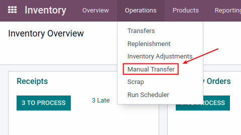
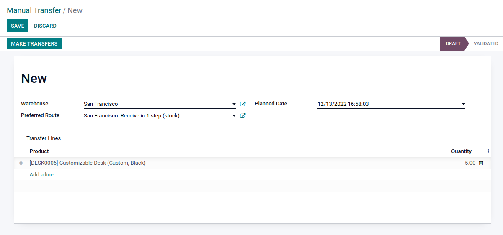
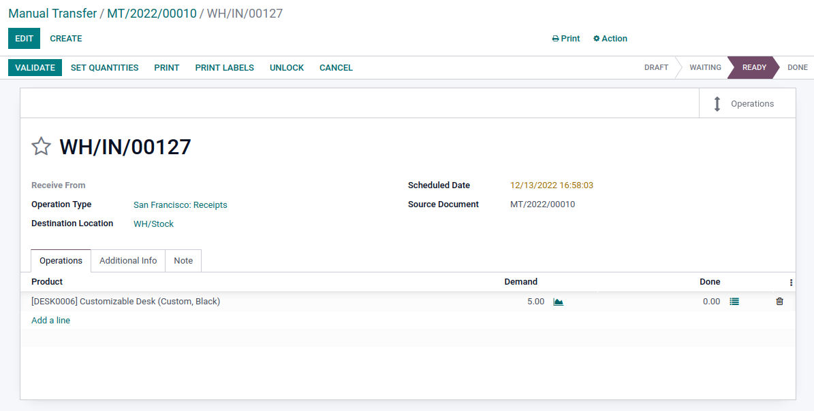

.. image:: https://img.shields.io/badge/licence-LGPL--3-blue.svg
    :alt: License: LGPL-3

Stock Manual Transfer:
----------------------

This module allows you to trigger transfers using a specific route, as it were triggered by a reordering rule.

- In order to be able to make the transfer, the user must belong to the stock manual transfer group:

- And the route must be allowed to make manual transfers:

A new item in the operations menu of the stock module will be shown in order to create Manual transfers:

Once the Manual Transfer has been created as 'draft', a button in the form will validate the transfer
and create a Transfer (picking):

Maintainer
----------

.. image:: https://www.vauxoo.com/logo.png
   :alt: Vauxoo
   :target: https://vauxoo.com

This module is maintained by Vauxoo.

a latinamerican company that provides training, coaching,
development and implementation of enterprise management
systems and bases its entire operation strategy in the use
of Open Source Software and its main product is Odoo.

To contribute to this module, please visit http://www.vauxoo.com
