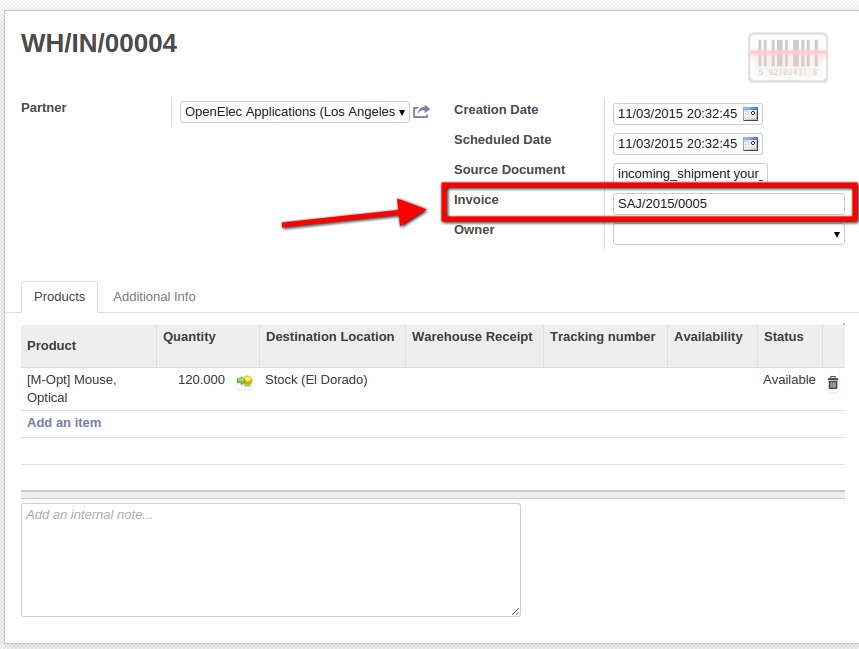

.. image:: https://img.shields.io/badge/licence-LGPL--3-blue.svg
    :alt: License: LGPL-3

Stock Picking Invoice Char Field
================================

Add invoice field of type char on picking model.

Installation
============

To install this module, you need to:

- Just install the module:

  - Download this module from `Vauxoo/addons-vauxoo
    <https://github.com/vauxoo/addons-vauxoo>`_
  - Add the repository folder into your odoo addons-path.
  - Go to ``Settings > Module list`` search for the current name and click in
    ``Install`` button.

Configuration
=============

To configure this module, you need to:

* There is not special configuration for this module.

Usage
=====

- Invoice field of char type that can be edited

Known issues / Roadmap
======================

Bug Tracker
===========

Bugs are tracked on `GitHub Issues <https://github.com/Vauxoo/addons-vauxoo/issues>`_.
In case of trouble, please check there if your issue has already been reported.
If you spotted it first, help us smashing it by providing a detailed and welcomed feedback
`here <https://github.com/Vauxoo/addons-vauxoo/issues/new?body=module:%20stock_picking_invoice_char_field%0Aversion:%201.0%0A%0A**Steps%20to%20reproduce**%0A-%20...%0A%0A**Current%20behavior**%0A%0A**Expected%20behavior**&title=[8.0]%20stock_picking_invoice_char_field:%20problem%20summary%20here>`_.

Credits
=======

**Contributors**

* Yanina Aular <yani@vauxoo.com>

Maintainer
==========

This module is maintained by Vauxoo.

.. image:: https://www.vauxoo.com/logo.png
    :alt: Vauxoo
    :target: https://www.vauxoo.com

To contribute to this module, please visit https://www.vauxoo.com.
